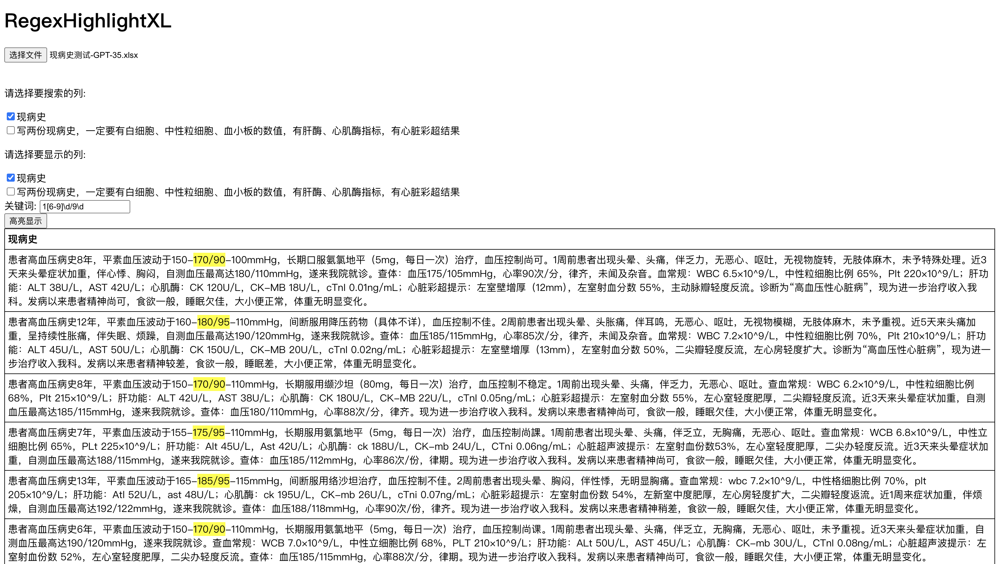

# Excel 文档关键词高亮显示工具

[](https://github.com/Reedphoto3/RegexHighlightXL/blob/main/LICENSE)

一个轻量级的 Excel 文本搜索工具，支持正则表达式，可以快速查找和高亮显示 Excel 文件中的文本内容。
特别适合处理和分析包含大量文本信息的 Excel 文档。

## 快速开始

1. 克隆仓库到本地：
```bash
git clone https://github.com/Reedphoto3/RegexHighlightXL.git
```

2. 直接在浏览器中打开 `RegexHighlightXL.html` 文件即可使用

或者直接[下载 ZIP 包](https://github.com/Reedphoto3/RegexHighlightXL/archive/refs/heads/main.zip)解压使用。

## 截图



## 功能特点

- 支持**正则表达式**搜索，快速定位关键信息
- 灵活的列选择功能：可分别设置搜索列和显示列
- 实时高亮显示匹配内容
- 支持多 Sheet 页面的 Excel 文件（.xlsx, .xls）
- 纯浏览器端实现，无需安装，打开即用

## 使用方法

1. 在浏览器中打开 `RegexHighlightXL.html` 文件
2. 点击"选择文件"按钮，上传需要处理的 Excel 文件
3. 如果文件包含多个 Sheet，在弹出的选择框中选择要处理的 Sheet
4. 在列选择区域：
   - 勾选需要搜索的列（这些列将用于关键词匹配）
   - 勾选需要显示的列（这些列将在结果中显示）
5. 在搜索框中输入关键词或正则表达式
6. 点击"高亮显示"按钮，查看匹配结果

## 技术栈

- JavaScript
- HTML5 File API
- 正则表达式
- SheetJS 用于 Excel 文件处理

## 项目结构

```
.
├── README.md
├── RegexHighlightXL.html    # 主页面
├── src/
│   └── RegexHighlightXL_1.js    # 主要业务逻辑
└── lib/
    └── xlsx.full.min.js     # SheetJS 库文件
```

## 开源协议

本项目采用 MIT License 开源。

## 致谢

本项目使用了以下开源软件：

- [SheetJS](https://sheetjs.com/) (Apache-2.0 License) - 用于 Excel 文件处理的优秀开源库

## 问题反馈

如果你发现了 bug 或者有新功能建议，欢迎[提交 issue](https://github.com/Reedphoto3/RegexHighlightXL/issues)。

## 许可证

本项目采用 MIT License 开源 - 查看 [LICENSE](LICENSE) 文件了解更多细节。
